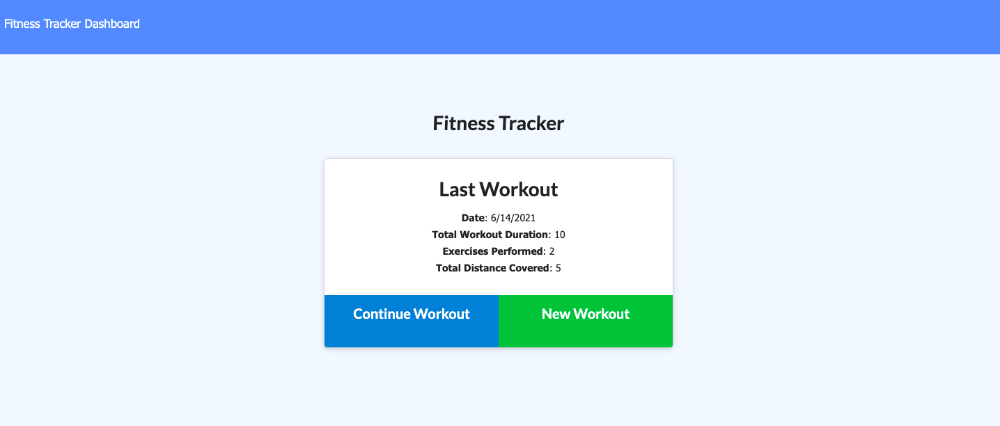
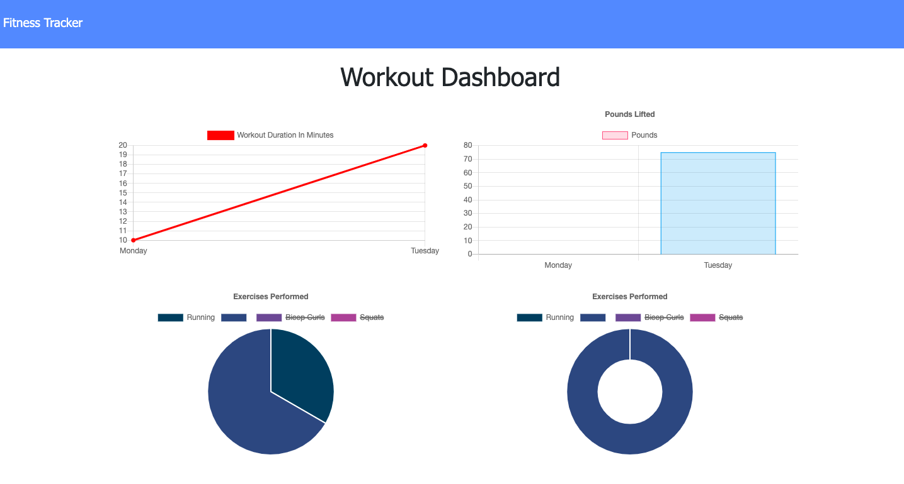

# Fitness Tracker

## Description 
For this project I worked with starter code to create a workout fitness tracker app. It utilizes HTML, CSS, Javascript, MongoDB and Mongoose. 

## Demo

## Table of Contents 
    
* [Installation](#installation)
* [Usage](#usage)
* [License](#license)
* [Contributing](#contributing)
* [Tests](#tests)
* [Questions](#questions)
    
    
## Installation Instructions 
To install dependancies and start this application run the following commands:
`npm i` 
`node server.js`
## Usage 
This application is intended to track a users workouts and display their progress on a stats page. 
The user should be able to:
* Add exercises to the most recent workout plan.
* Add new exercises to a new workout plan.
* View the combined weight of multiple exercises from the past seven workouts on the stats page.
* View the total duration of each workout from the past seven workouts on the stats page.

## License 
This project is licensed with MIT
## Contributors 
Kirsten Nelson
## Tests 
No tests needed for this application
## Questions 
 For questions contact Kirsten Nelson at https://github.com/kirmarnel 